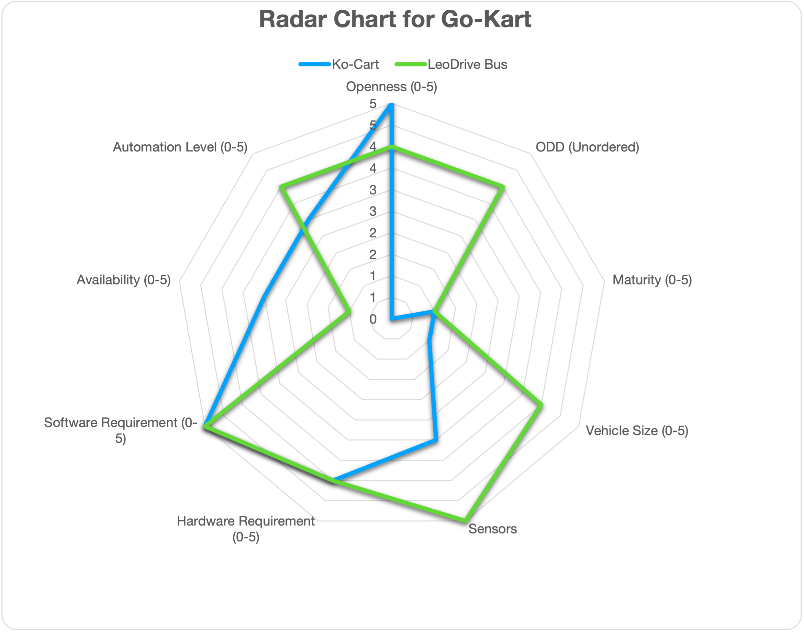

# Overview: 

This document elaborates the hardware and software configurations for using Autoware for autonomous driving. Hence, it will serve as a guideline to select hardware and software components to build autonomous vehicles. However, this document is NOT prepared as neither step-by-step instructions nor Q&A books, which will be provided as a reference link if available. 

# Design Overview: 

# Who should read: 
One is interested in building your small size autonomous vehicles and looks for the place to start with. 

# References and Resources: 
- Complete Go-Kart with Autoware documents: [link](https://go-kart-upenn.readthedocs.io/en/latest/)
- ROS2 Foxy setup and autonomous code: [link](https://github.com/mlab-upenn/gokart-sensor/tree/ros2_foxy_purepursuit)
    
- ROS2 Humble setup and autonomous code: [Link](https://github.com/mlab-upenn/gokart-sensor/tree/ros2_humble_purepursuit)
    
- STM32 nucleo controller code: [link](https://github.com/mlab-upenn/gokart-mechatronics/tree/main/STM32%20Control)

# Contributors:
-  Autoware Center of Excellence (under Prof. Rahul Mangharam)

# Targeted Use Cases

| Use Cases: | Education | Racing | PoC | Open AD Kit | Commercial Services/Production |
|:--------: | :--------:| :---------: | :---------: |:---------: | :---------: |
|F1Tenth | <input type="checkbox" checked />  | <input type="checkbox" checked />  | <input type="checkbox" checked  />  | <input type="checkbox" disabled  />  | <input type="checkbox" disabled  />  | 

# ODD

| ODD | Cargo | Bus | RoboTaxi | Low Speed (Utility) Vehicle | Delivery Robot |
|:--------: | :--------:| :---------: | :---------: |:---------: | :---------: |
|F1Tenth | <input type="checkbox" disabled  />  | <input type="checkbox" disabled />  | <input type="checkbox" disabled  />  | <input type="checkbox" disabled  />  | <input type="checkbox" disabled  />  | 

# Automation Level:
| Automation Level | 0 | 1 | 2 | 3 | 4 | 5 |
|:--------: | :--------:| :---------: | :---------: |:---------: | :---------: | :---------: |
|F1Tenth | <input type="checkbox" checked  />  |  <input type="checkbox" checked  />  | <input type="checkbox" checked />  | <input type="checkbox" checked  />  | <input type="checkbox" disabled  />  | <input type="checkbox" disabled  />  | 

# System Architecture

Autonomous Go-Kart is a one-third scale autonomous go-kart autonomous vehicle for development and prototyping purpose. It can be used for developing and testing software components in Autoware. 

![[avev_gokart.webp]]
# Hardware Configuration
## Chassis:
-  TopKart: [link to purchase]()

## Sensors:
- Lidar: Ouster LIDAR OS1 and Velodyne M1600
- Camera: OAK-D camera
- GNSS: RTK-GNSS

## Computing Platforms:
- X86 laptop with nVidia GPU

![[GoKart-ComputeSensing.png]]

# Software Configuration 
